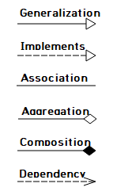

##### [UML] UML 기초

- Access Modifier

  - `-` : private
  - `+` : public
  - `#` : protected

- Relationship

  

  - `Generalization` : 상속 관계
  - `Impelement(Realization)` : 구현 관계
  - `Association` : 한 클래스가 다른 클래스를 멤버 변수로 가지고 있을 떄
    - `Aggregation` : 한 클래스가 다른 클래스를  가지고 있지만 직접 초기화 시키지 않음(약한 결합)
    - `Composition` : 한 클래스가 다른 클래스를  가지고, 직접 초기화 시킴(강한 결합)
  - `Dependency` : 의존 관계, 의존하는 클래스가 변하면 해당 클래스도 변해야 함

  [UML 클래스 다이어그램 기본상식 ( C# )](http://hongjinhyeon.tistory.com/25), [[UML] Class Diagram 기본](http://infinitejava.tistory.com/61)

  

